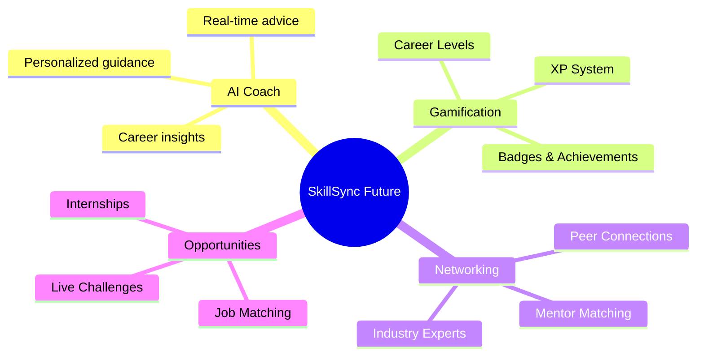

<div align="center">

# 🎯 SkillSync

### `AI-Powered Career Growth Platform` • `Skill Gap Analysis` • `Career Path Prediction`


<br/>

[](https://github.com/NufalXBaalash/SkillSync/stargazers)
[](https://github.com/NufalXBaalash/SkillSync/network/members)
[](https://github.com/NufalXBaalash/SkillSync/issues)
[](LICENSE)

</div>

---

## 💡 Project Overview


**SkillSync** is an intelligent career acceleration platform that leverages AI to transform how professionals approach skill development and career growth. By analyzing your current capabilities and industry demands, SkillSync creates personalized learning pathways that bridge the gap between where you are and where you want to be.

```yaml
mission: "Democratize career growth through AI-powered insights"
vision: "Every professional equipped with clear career direction"
stage: "MVP Development & Feature Planning"
target_users: ["Career Switchers", "Recent Graduates", "Upskilling Professionals"]
```

### 🎯 **Core Problems We Solve:**
- **Skill Visibility Gap**: Many don't know their true skill level
- **Career Direction Uncertainty**: Unclear paths to desired roles  
- **Learning Resource Overload**: Too many options, no guidance
- **Progress Tracking Difficulty**: No centralized growth measurement

---

## 🚀 Features & Capabilities

### 🎪 **MVP Launch Features**

<details>
<summary><b>🔍 AI Skill Assessment Engine</b></summary>

- **Multi-Source Analysis**: CV, GitHub, LinkedIn profile parsing
- **Manual Skill Input**: Custom skill entry with proficiency levels
- **Gap Detection**: AI identifies missing skills for target roles
- **Confidence Scoring**: Skill assessment with reliability metrics

</details>

<details>
<summary><b>🗺️ Career Path Intelligence</b></summary>

- **Role Prediction**: Smart career suggestions with timelines
- **Interactive Roadmaps**: Visual progress tracking with milestones
- **Timeline Estimation**: Data-driven career transition forecasts
- **Alternative Paths**: Multiple routes to achieve career goals

</details>

<details>
<summary><b>🎮 Job Simulation Modules</b></summary>

- **Real-World Tasks**: Industry-specific challenges and projects
- **Instant Feedback**: AI-powered evaluation and suggestions
- **Skill Application**: Practice skills in realistic scenarios
- **Performance Analytics**: Detailed progress and improvement tracking

</details>

<details>
<summary><b>📚 Smart Resource Recommendations</b></summary>

- **Curated Learning Paths**: Personalized course recommendations
- **Multi-Format Resources**: Videos, articles, tutorials, and books
- **Skill-Level Filtering**: Beginner to advanced resource matching
- **Learning Style Adaptation**: Visual, auditory, and hands-on options

</details>

<details>
<summary><b>📊 Personal Growth Dashboard</b></summary>

- **Skills Overview**: Current abilities and growth trajectory
- **Progress Tracking**: Completed tasks and upcoming challenges
- **Achievement System**: Milestones and skill certifications
- **Analytics**: Visual progress reports and trend analysis

</details>

### 🌟 **Future Roadmap**

<div align="center">

| Phase | Features | Timeline |
|-------|----------|----------|
| **🚀 Phase 1** | AI Coach Chatbot, Gamification System | Q2 2024 |
| **🤝 Phase 2** | Peer Networking, Mentor Matching | Q3 2024 |
| **🏆 Phase 3** | Live Challenges, Portfolio Builder | Q4 2024 |
| **💼 Phase 4** | Job Matching, Interview Practice | Q1 2025 |

</div>

#### 🎯 **Advanced Features Coming Soon:**



---

## 🛠️ Technology Architecture

<div align="center">

### **Frontend Stack**


### **Backend Infrastructure**


### **AI & Machine Learning**


### **DevOps & Tools**


</div>

---

## 📦 Quick Start

### **Prerequisites**
```bash
node >= 16.0.0
npm >= 8.0.0
git >= 2.0.0
```

### **Installation & Setup**

```bash
# 🚀 Clone the repository
git clone https://github.com/NufalXBaalash/SkillSync.git

# 📂 Navigate to project directory
cd SkillSync

# 📦 Install dependencies
npm install

# ⚙️ Set up environment variables
cp .env.example .env.local
# Edit .env.local with your API keys

# 🔥 Start development server
npm run dev

# 🌐 Open in browser
# http://localhost:3000
```

### **Environment Configuration**

```env
# AI Services
OPENAI_API_KEY=your_openai_api_key
HUGGINGFACE_API_KEY=your_hf_api_key

# Database
MONGODB_URI=your_mongodb_connection_string
DATABASE_URL=your_postgresql_url

# Authentication
NEXTAUTH_SECRET=your_auth_secret
NEXTAUTH_URL=http://localhost:3000

# External APIs
LINKEDIN_CLIENT_ID=your_linkedin_client_id
GITHUB_CLIENT_ID=your_github_client_id
```

---

## 📊 Project Status

<div align="center">

### **Development Progress**

```
🏗️  Architecture Design     ████████████████████░   95%
🎨  UI/UX Prototyping       ████████████████░░░░░   80%
⚙️  Backend Development     ████████████░░░░░░░░░   60%
🤖  AI Integration          ████████░░░░░░░░░░░░░   40%
🧪  Testing & QA            ████░░░░░░░░░░░░░░░░░   20%
🚀  Deployment Ready        ██░░░░░░░░░░░░░░░░░░░   10%
```

</div>

### **Current Milestone: MVP Launch** 🎯

- [x] Project architecture and tech stack finalization
- [x] UI/UX wireframes and design system
- [ ] Core feature implementation (In Progress)
- [ ] AI model integration and testing
- [ ] Beta user testing and feedback
- [ ] Production deployment and launch

---

## 🤝 Contributing

We welcome contributors from all backgrounds! Whether you're interested in AI, frontend development, UX design, or career coaching, there's a place for you in SkillSync.

### **How to Contribute:**

1. **🍴 Fork the repository**
2. **🌿 Create your feature branch** (`git checkout -b feature/AmazingFeature`)
3. **💻 Make your changes** and add tests
4. **✅ Commit your changes** (`git commit -m 'Add some AmazingFeature'`)
5. **📤 Push to the branch** (`git push origin feature/AmazingFeature`)
6. **🔀 Open a Pull Request**

### **Contribution Areas:**
- 🤖 **AI/ML Development**: Skill assessment algorithms, career prediction models
- 🎨 **Frontend Development**: React components, user experience improvements  
- ⚙️ **Backend Development**: API endpoints, database optimization
- 📝 **Documentation**: Technical writing, user guides, API documentation
- 🧪 **Testing**: Unit tests, integration tests, user acceptance testing

---

## 📞 Connect With the Team

<div align="center">

[](https://www.linkedin.com/in/yousef-fady-bb95512bb)
[](mailto:gidgect@gmail.com)
[](https://github.com/NufalXBaalash)
[](#)

</div>

---

## 📄 License

This project is licensed under the **MIT License** - see the [LICENSE](LICENSE) file for details.

---

<div align="center">

### 🌟 **Star the repository if you find it helpful!** 🌟


**"Transforming careers, one skill at a time"** 🚀

</div>
