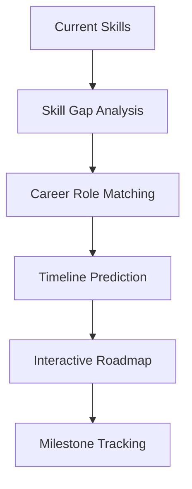

<div align="center">

# ✈️ SkillPilot

### `AI-Powered Career Navigation` • `Skill Discovery` • `Growth Planning`


<br/>

[](https://github.com/NufalXBaalash/SkillSync/stargazers)
[](https://github.com/NufalXBaalash/SkillSync/network/members)
[](https://github.com/NufalXBaalash/SkillSync/issues)
[](LICENSE)
[](https://github.com/NufalXBaalash/SkillSync/pulls)

</div>

---

## 💡 What is SkillPilot?


**SkillPilot** is an AI-powered career navigation tool designed to help students and professionals discover their skills, track progress, and plan future career paths. Think of it as your **co-pilot for growth**: analyzing skills, simulating real jobs, and recommending learning resources — all in one place.

```yaml
problem: "Career direction uncertainty and skill gap confusion"
solution: "AI-powered skill assessment and career path guidance"
target_users: ["Students", "Career Switchers", "Upskilling Professionals"]
stage: "MVP Development"
```

### 🎯 **Why SkillPilot?**
- **🔍 Skill Visibility**: Understand your true capabilities and gaps
- **🗺️ Clear Direction**: Get personalized career roadmaps with timelines
- **🎮 Hands-on Practice**: Simulate real job tasks before applying
- **📚 Smart Learning**: Curated resources matching your goals
- **📊 Progress Tracking**: Monitor your growth journey

---

## 🚀 Features Overview

### 🎪 **MVP Features (Development Ready)**

<details>
<summary><b>🔍 AI Skill Assessment Engine</b></summary>

<br/>

**Input Methods:**
- **📄 CV Upload**: Parse PDF/DOC files for skill extraction
- **🔗 Profile Import**: Connect GitHub or LinkedIn accounts
- **✋ Manual Entry**: Add skills with proficiency levels

**Assessment Process:**
```
📤 Upload/Input → 🤖 AI Analysis → 📊 Skill Mapping → 🎯 Gap Identification → 📋 Report Generation
```

**Output:**
- Current skill inventory with confidence levels
- Identified skill gaps for target roles
- Personalized improvement recommendations

</details>

<details>
<summary><b>🗺️ Career Path Prediction</b></summary>

<br/>

**Path Generation:**
- **Role Suggestions**: AI-recommended career positions
- **Timeline Estimates**: Realistic progression schedules
- **Interactive Roadmaps**: Visual milestone tracking
- **Alternative Routes**: Multiple paths to same goal

**Visualization:**


</details>

<details>
<summary><b>🎮 Job Simulation Modules</b></summary>

<br/>

**Simulation Types:**
- **💻 Technical Tasks**: Coding challenges, data analysis
- **📊 Business Scenarios**: Project planning, strategy development
- **🎨 Creative Projects**: Design tasks, content creation
- **🤝 Soft Skills**: Communication, leadership exercises

**Process Flow:**
1. Select target career role
2. Choose relevant simulation
3. Complete real-world mini tasks
4. Receive instant feedback
5. Track skill improvement

</details>

<details>
<summary><b>📚 Learning Resource Hub</b></summary>

<br/>

**Resource Categories:**
- 🎥 **Video Tutorials**: Expert-led courses and lectures
- 📖 **Articles & Guides**: In-depth technical documentation
- 💻 **Interactive Courses**: Hands-on coding platforms
- 🎯 **Practice Projects**: Real-world application exercises

**Smart Filtering:**
```yaml
filters:
  skill_level: ["Beginner", "Intermediate", "Advanced"]
  learning_style: ["Visual", "Auditory", "Hands-on", "Reading"]
  duration: ["< 1 hour", "1-5 hours", "5+ hours"]
  format: ["Free", "Paid", "Certification"]
```

</details>

<details>
<summary><b>📊 Personal Dashboard</b></summary>

<br/>

**Dashboard Components:**
- **📈 Skill Progress**: Visual growth tracking
- **🎯 Goal Monitoring**: Career milestone progress
- **🏆 Achievements**: Completed simulations and badges
- **📅 Learning Schedule**: Personalized study plans
- **📊 Analytics**: Performance insights and trends

</details>

### 🌟 **Future Roadmap**

<div align="center">

| Phase | Features | Status |
|-------|----------|---------|
| **🚀 Phase 1** | AI Career Coach Chatbot | 📋 Planned |
| **🎮 Phase 2** | Gamification System (XP, Badges, Streaks) | 📋 Planned |
| **🤝 Phase 3** | Peer & Mentor Networking | 📋 Planned |
| **🏆 Phase 4** | Live Challenges & Hackathons | 📋 Planned |
| **💼 Phase 5** | Job Matching & Recruiter Partnerships | 📋 Planned |

</div>

**🔮 Advanced Features on Horizon:**
- **🤖 AI Career Coach**: Real-time personalized guidance
- **🎯 Gamification**: XP points, streaks, and achievement badges  
- **🌐 Networking Hub**: Connect with peers and mentors
- **📁 Portfolio Builder**: Auto-generate LinkedIn-ready portfolios
- **🎭 Interview Prep**: AI roleplay for soft skill training
- **🔄 Platform Sync**: Auto-sync with LinkedIn, GitHub, Behance
- **📊 Advanced Analytics**: Deep insights into skill growth patterns

---

## 🛠️ Technology Stack

<div align="center">

### **Frontend Development**


### **Backend Infrastructure**  


### **AI & Machine Learning**


### **Authentication & Deployment**


</div>

---

## 📦 Getting Started

### **Prerequisites**
```bash
Node.js >= 18.0.0
npm >= 9.0.0
Git >= 2.0.0
```

### **Quick Installation**

```bash
# 🚀 Clone the repository
git clone https://github.com/NufalXBaalash/SkillSync.git

# 📂 Navigate to project directory
cd SkillSync

# 📦 Install dependencies
npm install

# 🔥 Start development server
npm run dev

# 🌐 Open in browser
# http://localhost:3000
```

### **Environment Setup**

```bash
# Copy environment template
cp .env.example .env.local

# Add your API keys (when available)
OPENAI_API_KEY=your_openai_key_here
MONGODB_URI=your_mongodb_connection_string
FIREBASE_CONFIG=your_firebase_config
```

---

## 📊 Project Status

<div align="center">

### **Development Progress**

```
🏗️  Project Setup & Planning    ████████████████████░   95%
🎨  UI/UX Design               ████████████████░░░░░   80%
⚙️  Backend Development        ████████████░░░░░░░░░   60%
🤖  AI Integration             ████████░░░░░░░░░░░░░   40%
🧪  Testing & Quality          ████░░░░░░░░░░░░░░░░░   20%
🚀  MVP Deployment             ██░░░░░░░░░░░░░░░░░░░   10%
```

</div>

### **Current Milestone: MVP Development** 🎯

- [x] ✅ Project architecture and technology decisions
- [x] ✅ Initial UI/UX wireframes and design system
- [ ] 🔄 Core feature implementation (In Progress)
- [ ] ⏳ AI model integration and testing
- [ ] ⏳ User authentication system
- [ ] ⏳ Dashboard and analytics implementation
- [ ] ⏳ Beta testing and user feedback collection

---

## 🤝 Contributing

We welcome contributors who are passionate about AI, career development, and helping others grow! Whether you're a developer, designer, or domain expert, there's a place for you.

### **How to Contribute:**

1. **🍴 Fork** the repository
2. **🌿 Create** your feature branch (`git checkout -b feature/AmazingFeature`)
3. **💻 Commit** your changes (`git commit -m 'Add some AmazingFeature'`)
4. **📤 Push** to the branch (`git push origin feature/AmazingFeature`)
5. **🔀 Open** a Pull Request

### **Areas Where We Need Help:**
- 🎨 **Frontend Development**: React components, user experience improvements
- ⚙️ **Backend Development**: API design, database optimization
- 🤖 **AI/ML Integration**: Skill assessment algorithms, career prediction models
- 📝 **Documentation**: User guides, technical documentation
- 🧪 **Testing**: Unit tests, integration tests, user testing
- 🎯 **Product**: Feature ideation, user research, market analysis

---

## 📞 Connect & Support

<div align="center">

### **Get in Touch**
[](https://www.linkedin.com/in/yousef-fady)
[](mailto:gidgect@gmail.com)
[](https://github.com/NufalXBaalash)

### **Project Resources**
[](https://github.com/NufalXBaalash/SkillSync/issues)
[](https://github.com/NufalXBaalash/SkillSync/discussions)
[](https://github.com/NufalXBaalash/SkillSync/wiki)

</div>

---

## 📄 License

This project is licensed under the **MIT License** - see the [LICENSE](LICENSE) file for details.

---

<div align="center">

### 🌟 **Star the repo if you find it interesting!** 🌟

**Made with ❤️ for the developer community**


</div>
